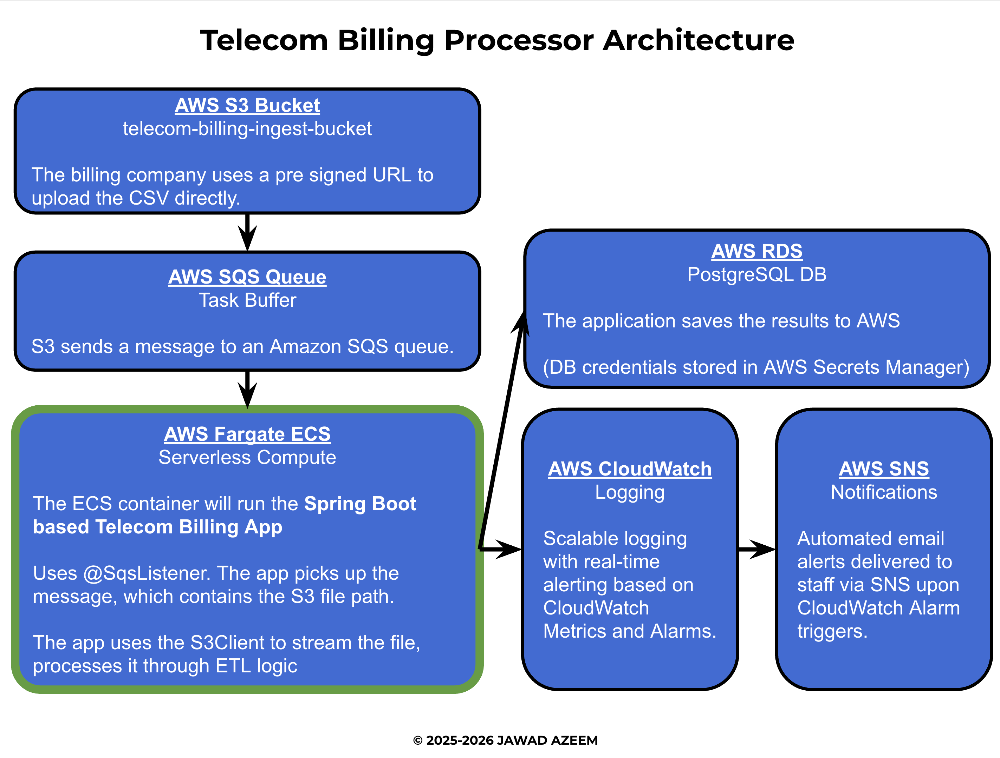

# Blueprint: Telecom Billing Intelligence

### Author: Jawad Azeem
This is a Spring Boot application that performs a full ETL (Extract, Transform, Load) workflow on telecom billing data stored in CSV format.
It reads the data, processes it into structured records, computes various analytics, and exposes the results via REST API endpoints.
A live version of the API is hosted on AWS.

## Functionality
- Reads billing data from a CSV file using a custom parser
- Converts each row into a `BillingRecord`
- Aggregates analytics such as:
    - total charges
    - highest charge
    - record count
    - charges grouped by state
- Exposes results through REST API endpoints

## Access the Live API at:
   - https://telecom.jawadazeem.com

## Technologies Used
- Java 21
- Spring Boot (Web)
- AWS (ECS, RDS, CloudWatch, SQS, SNS, S3)
- Docker
- JUnit 5 & Mockito
- PostgreSQL

## Architecture

Version: **v2**