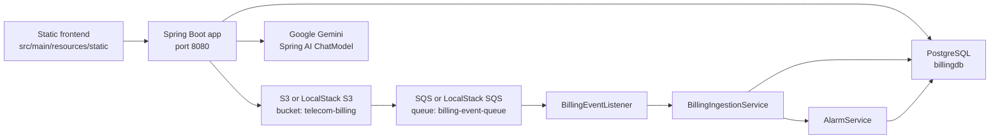

# Blueprint Onboarding and Setup Guide

This guide documents the current implementation of the Blueprint repository. It is intentionally based on the files, scripts, configuration, and source code that exist in this repo today.

Blueprint is a Spring Boot 3.5.7 application for telecom billing analytics. It serves a static HTML/CSS/JavaScript frontend from `src/main/resources/static`, exposes REST APIs for billing data, uploads CSV files into S3 or LocalStack S3, ingests S3 object-created events through SQS, stores records in PostgreSQL through Spring Data JPA, detects billing alarms, and integrates with Google Gemini through Spring AI for the Martin natural-language analytics endpoint.

## Current Architecture Overview



The recommended local setup is Docker Compose using `docker-compose.dev.yml`, because that path creates PostgreSQL, LocalStack, the S3 bucket, the SQS queue, the S3-to-SQS notification bridge, and the application container.

## Quickstart: 5-Minute Setup

Prerequisites: Docker Desktop or Docker Engine with Compose, plus a valid `.env` file at the repo root.

```bash
cd /Users/Jawad/Downloads/blueprint
docker compose --env-file .env -f docker-compose.dev.yml up --build
```

Open the app:

```text
http://localhost:8080/
```

Load demo data:

```bash
curl -X POST http://localhost:8080/demo-load
curl http://localhost:8080/periods
curl http://localhost:8080/summary/period/dummy-data
```

Stop the stack:

```bash
docker compose -f docker-compose.dev.yml down
```

## 1. Prerequisites

| Tool | Required by | Version observed or declared |
|---|---|---|
| Java | Spring Boot runtime and Maven build | Project targets Java 21 in `pom.xml`; Docker uses Eclipse Temurin 21. Local machine currently reports Java 25.0.1. |
| Maven | Build and tests | Maven wrapper config exists under `.mvn/wrapper`, but no `mvnw` script is present. Local Maven observed: 3.9.12. Docker build image: Maven 3.9.9 with Temurin 21. |
| Docker + Docker Compose | Recommended local stack | Compose files use Postgres 16, LocalStack 3.0.0, amazon/aws-cli, and the app image built from `Dockerfile`. |
| Google Gemini API credentials | Martin AI endpoint | Required for `/martin` unless that feature is unused. Configured through Spring AI / Google GenAI properties. |

No Node.js package manager is used by this project. There is no `package.json`, no frontend bundler, and no monorepo tooling.

## 2. Repository Setup

Clone and enter the repo:

```bash
git clone <repo-url> blueprint
cd blueprint
```

Current top-level structure:

```text
.
├── .github/workflows/docker-pipeline.yml
├── .mvn/wrapper/maven-wrapper.properties
├── Dockerfile
├── LICENSE
├── README.md
├── app.log
├── docker-compose.dev.yml
├── docker-compose.prod.yml
├── docs/
├── images/
│   └── application-cloud-architecture-diagram.png
├── init-s3.sh
├── pom.xml
├── scripts/
│   ├── run-dev.sh
│   ├── run-prod.sh
│   └── run-test.sh
├── src/
│   ├── main/
│   │   ├── java/com/azeem/blueprint/
│   │   └── resources/
│   └── test/java/com/azeem/blueprint/
└── target/
```

Important source tree:

```text
src/main/java/com/azeem/blueprint/
├── BlueprintApplication.java
├── config/
├── controller/
├── demo/
├── entity/
├── etl/
├── exception/
├── listener/
├── mapper/
├── model/
├── repository/
├── service/
├── util/
└── validation/
```

Static frontend tree:

```text
src/main/resources/static/
├── index.html
├── login.html
├── info.html
├── error/404.html
├── css/
├── js/
└── assets/
```

## 3. Environment Variables

The true source of application configuration is `src/main/resources/application.yaml`. Docker Compose also reads `.env` for variable substitution.

Security note: the current repo contains a checked-in `.env` with real-looking secrets and tokens. Treat those values as compromised. Do not copy secrets into docs, issue trackers, or chat logs.

### Variables Used by Compose

| Variable | Used in | Purpose | Notes |
|---|---|---|---|
| `DB_USERNAME` | `docker-compose.dev.yml`, `docker-compose.prod.yml` | App DB username | Postgres container user is hardcoded as `billing_app`; `.env` currently matches. |
| `DB_PASSWORD` | Compose files | Postgres and app DB password | Required for local Docker setup. |
| `CF_TUNNEL_TOKEN` | `docker-compose.prod.yml` | Cloudflare tunnel token | Production-like Compose only. |
| `GOOGLE_GENAI_API_KEY` | Compose substitution | Gemini API key value source | Compose maps this into `SPRING_AI_GOOGLE_GENAI_API_KEY`. |
| `GOOGLE_PROJECT_ID` | Compose substitution | Google project id value source | `.env` currently has spacing around `=`, but `docker compose config` still resolved it. |
| `AWS_ACCESS_KEY` | `docker-compose.prod.yml` | App AWS access key | Dev Compose hardcodes `test`. |
| `AWS_SECRET_KEY` | `docker-compose.prod.yml` | App AWS secret key | Dev Compose hardcodes `test`. |

### Variables Used by `application.yaml`

| Variable | Profile | Purpose | Default |
|---|---|---|---|
| `AWS_S3_ENDPOINT` | all | S3 endpoint | `http://billing-s3-mock:4566` |
| `AWS_SQS_ENDPOINT` | all | SQS endpoint | `http://billing-s3-mock:4566` |
| `AWS_REGION` | all | AWS region | `us-east-1` |
| `AWS_ACCESS_KEY` | all | AWS credential | `test` |
| `AWS_SECRET_KEY` | all | AWS credential | `test` |
| `GOOGLE_PROJECT_ID` | all | Spring AI Google project id placeholder | no default |
| `GOOGLE_GENAI_API_KEY` | all | Spring AI Google API key placeholder | no default |
| `SPRING_DATASOURCE_URL` | `dev` | JDBC URL | required |
| `SPRING_DATASOURCE_USERNAME` | `dev` | DB username | required |
| `SPRING_DATASOURCE_PASSWORD` | `dev` | DB password | required |
| `TEST_DB_URL` | `test` | Test profile JDBC URL | required when running app with `test` profile |
| `TEST_DB_USERNAME` | `test` | Test profile DB username | required |
| `TEST_DB_PASSWORD` | `test` | Test profile DB password | required |
| `PROD_DB_URL` | `prod` | Production profile JDBC URL | required |
| `PROD_DB_USERNAME` | `prod` | Production profile DB username | required |
| `PROD_DB_PASSWORD` | `prod` | Production profile DB password | required |

### Configuration Inconsistency to Know

`application.yaml` references `GOOGLE_PROJECT_ID` and `GOOGLE_GENAI_API_KEY`. The Compose files pass `SPRING_AI_GOOGLE_GENAI_PROJECT_ID` and `SPRING_AI_GOOGLE_GENAI_API_KEY` into the app container. Depending on Spring AI property binding, this may work as an override, but it does not directly satisfy the placeholders shown in `application.yaml`. If Martin fails at startup or request time, check these variables first.

## 4. Database Setup

The app uses PostgreSQL in Docker and Spring Data JPA/Hibernate for schema creation.

| Profile | Datasource variables | Hibernate mode |
|---|---|---|
| `dev` | `SPRING_DATASOURCE_URL`, `SPRING_DATASOURCE_USERNAME`, `SPRING_DATASOURCE_PASSWORD` | `create-drop` |
| `test` | `TEST_DB_URL`, `TEST_DB_USERNAME`, `TEST_DB_PASSWORD` | `create-drop` |
| `prod` | `PROD_DB_URL`, `PROD_DB_USERNAME`, `PROD_DB_PASSWORD` | `update` |

There are no Flyway or Liquibase migrations in the repo. Schema is generated from JPA entities.

Primary tables generated from entities:

| Entity | Table | Primary key | Notes |
|---|---|---|---|
| `BillingRecordEntity` | `billing_records` | generated `long id` | Indexed on `billingPeriod` and descending `totalCharge`. |
| `AlarmEntity` | `alarms` | generated UUID `id` | Unique `business_key`; stores scope, severity, period, timestamp, optional employee/phone/department. |

Start only DB and LocalStack services if needed:

```bash
docker compose --env-file .env -f docker-compose.dev.yml up postgres localstack aws-cli-setup
```

Connect to Postgres from host:

```bash
psql "postgresql://billing_app:<DB_PASSWORD>@localhost:5432/billingdb"
```

## 5. Backend Setup

Build with Maven:

```bash
mvn package
```

Run locally against externally available services:

```bash
export SPRING_PROFILES_ACTIVE=dev
export SPRING_DATASOURCE_URL=jdbc:postgresql://localhost:5432/billingdb
export SPRING_DATASOURCE_USERNAME=billing_app
export SPRING_DATASOURCE_PASSWORD=<DB_PASSWORD>
export AWS_S3_ENDPOINT=http://localhost:4566
export AWS_SQS_ENDPOINT=http://localhost:4566
export AWS_REGION=us-east-1
export AWS_ACCESS_KEY=test
export AWS_SECRET_KEY=test
export GOOGLE_GENAI_API_KEY=<gemini-api-key>
export GOOGLE_PROJECT_ID=<google-project-id>

java -jar target/blueprint.jar
```

Existing helper scripts:

| Script | What it does | Current caveat |
|---|---|---|
| `scripts/run-dev.sh` | Sets `SPRING_PROFILES_ACTIVE=dev` and runs `target/blueprint.jar` | Does not set datasource, AWS, or Gemini env vars. Assumes `target/blueprint.jar` already exists. |
| `scripts/run-prod.sh` | Sets `SPRING_PROFILES_ACTIVE=prod` and runs `target/blueprint.jar` | Does not set prod datasource vars. |
| `scripts/run-test.sh` | Sets `SPRING_PROFILES_ACTIVE=test` and runs `target/blueprint.jar` | This runs the app with test profile; it does not run Maven tests. |
| `init-s3.sh` | Exists but is empty | Not used. Compose embeds LocalStack setup inline. |

## 6. Frontend Setup

The frontend is static HTML/CSS/JavaScript served by Spring Boot from `src/main/resources/static`.

Pages:

| Page | Purpose |
|---|---|
| `/` or `/index.html` | Dashboard: summary cards, records table, charts, alarms, upload, demo load, Martin chat. |
| `/login.html` | Demo login screen. Sign-in validates non-empty fields and redirects to `/`; guest also redirects to `/`. There is no real backend auth. |
| `/info.html` | Project information page. |
| `/error/404.html` | Custom 404 page, with Spring whitelabel disabled. |

There is no frontend build command. CSS and JS are linked directly:

```html
<link rel="stylesheet" href="/css/main.css">
<script src="/js/main.js"></script>
```

Because paths are root-relative, opening HTML files directly with `file://` will not resolve assets correctly. Use Spring Boot or serve the static folder:

```bash
cd src/main/resources/static
python3 -m http.server 8081
```

Then open:

```text
http://localhost:8081/login.html
```

## 7. External Services

| Service | Local implementation | Production-like implementation in repo | Used for |
|---|---|---|---|
| PostgreSQL | `postgres:16` | `postgres:16` with host bind mount under `/home/jawadazeem/postgres_persistence` | Billing and alarm persistence. |
| S3 | LocalStack 3.0.0 | LocalStack 3.0.0, not real AWS | Uploaded CSV files and ingestion error logs. |
| SQS | LocalStack 3.0.0 | LocalStack 3.0.0, not real AWS | S3 object-created event delivery to app listener. |
| Google Gemini | External Google GenAI API | External Google GenAI API | Martin natural-language SQL and explanation flow. |
| Cloudflare Tunnel | not in dev Compose | `cloudflare/cloudflared:latest` | Exposes production-like local server. |

The README mentions AWS ECS, RDS, CloudWatch, SQS, SNS, and S3. The current checked-in deployment file does not provision ECS/RDS/SNS/CloudWatch; `docker-compose.prod.yml` explicitly says it is not real production infrastructure and uses LocalStack for cost-free deployment.

## 8. Docker / Containers

### Development Compose

```bash
docker compose --env-file .env -f docker-compose.dev.yml up --build
```

Services:

| Service | Container | Port | Purpose |
|---|---|---|---|
| `app` | `billing-app` | `8080:8080` | Spring Boot app. |
| `postgres` | `billing-postgres` | `5432:5432` | PostgreSQL database. |
| `localstack` | `billing-s3-mock` | `4566:4566` | Local S3 and SQS. |
| `aws-cli-setup` | `infra-setup` | none | Creates SQS queue, S3 bucket, and bucket notification config. |

LocalStack setup creates:

```text
S3 bucket: telecom-billing
SQS queue: billing-event-queue
S3 event: s3:ObjectCreated:* -> billing-event-queue
```

### Production-Like Compose

```bash
docker compose --env-file .env -f docker-compose.prod.yml up --build -d
```

This file adds a Cloudflare tunnel and uses host bind mounts:

```text
/home/jawadazeem/postgres_persistence
/home/jawadazeem/localstack_persistence
```

Important caveat: `docker-compose.prod.yml` sets `SPRING_PROFILES_ACTIVE=dev`, not `prod`. That means Hibernate runs with `ddl-auto: create-drop` in the production-like Compose path. This is a major data-loss risk if used with persistent data.

### Dockerfile

The Dockerfile is a two-stage build:

1. `maven:3.9.9-eclipse-temurin-21` runs `mvn package`.
2. `eclipse-temurin:21-jre-alpine` runs `java -jar app.jar`.

Because `mvn package` runs the Maven validate phase, Docker builds are currently blocked if Spotless fails.

## 9. Local Development Workflow

Recommended path:

```bash
docker compose --env-file .env -f docker-compose.dev.yml up --build
```

In another terminal:

```bash
curl http://localhost:8080/actuator/health
curl -X POST http://localhost:8080/demo-load
curl http://localhost:8080/periods
curl http://localhost:8080/departments
curl http://localhost:8080/summary/period/dummy-data
```

Typical browser flow:

1. Open `http://localhost:8080/`.
2. Click `Help`.
3. Click `Load Dummy Data`.
4. Select `dummy-data` from the period dropdown if needed.
5. Use `Filter by Department`, `Top N`, `Alarms`, and Martin chat.

Upload a CSV manually:

```bash
curl -F "file=@src/main/resources/dummy-data.csv" http://localhost:8080/upload
```

Expected CSV column order:

```text
Account_Name,Employee_ID,Department,Phone_Number,Billing_Period,Minutes_Used,Data_GB_Used,SMS_Count,Total_Charge
```

## 10. Seed / Mock Data

The repo includes `src/main/resources/dummy-data.csv`, a 1,200-line CSV including the header. The demo loader ingests it with billing period `dummy-data`.

Seed through the API:

```bash
curl -X POST http://localhost:8080/demo-load
```

Relevant implementation:

| File | Role |
|---|---|
| `src/main/java/com/azeem/blueprint/demo/LoadDummyDataService.java` | Loads `dummy-data.csv` from the classpath. |
| `src/main/java/com/azeem/blueprint/controller/BillingController.java` | Exposes `POST /demo-load`. |
| `src/main/java/com/azeem/blueprint/validation/BillingPeriodFormatValidator.java` | Allows `dummy-data` as the only non-`YYYY-MM` billing period. |

The loader checks `existsByBillingPeriod("dummy-data")` and skips if already loaded.

## 11. Scripts and Commands

| Task | Command | Current status |
|---|---|---|
| Build jar | `mvn package` | Currently blocked by Spotless violations unless fixed. |
| Run tests | `mvn test` | Currently blocked by Spotless before tests execute. |
| Format Java | `mvn spotless:apply` | Available through Spotless plugin. |
| Check formatting | `mvn spotless:check` | Bound to Maven `validate`. |
| Start dev stack | `docker compose --env-file .env -f docker-compose.dev.yml up --build` | Recommended. Build may fail until Spotless issues are fixed. |
| Render dev Compose config | `docker compose --env-file .env -f docker-compose.dev.yml config` | Verified successfully. |
| Run existing jar as dev | `./scripts/run-dev.sh` | Requires `target/blueprint.jar` and env vars/services. |
| Run existing jar as prod | `./scripts/run-prod.sh` | Requires `target/blueprint.jar` and prod env vars/services. |

Current `mvn test` failure observed:

```text
Spotless.Java ... 2 needs changes to be clean
src/test/java/com/azeem/blueprint/mapper/AlarmMapper.java
src/test/java/com/azeem/blueprint/mapper/BillingRecordMapper.java
```

These files are test-scope placeholders/classes under `src/test/java/com/azeem/blueprint/mapper/`, and Spotless wants them formatted as single-line empty classes.

## 12. API Reference

There is no OpenAPI/Swagger configuration in the repo. The API surface is defined by Spring controllers.

### Billing API

| Method | Path | Purpose |
|---|---|---|
| `POST` | `/upload` | Upload CSV file to S3 bucket `telecom-billing`. Processing happens through S3/SQS listener. |
| `POST` | `/demo-load` | Ingest built-in `dummy-data.csv` directly. |
| `GET` | `/records?page=0&size=20` | Page all billing records. |
| `GET` | `/summary` | Summary across all records. |
| `GET` | `/records/department/{department}?page=0&size=20` | Page records by department, case-insensitive. |
| `GET` | `/top/{n}` | Top N records by charge. `n` is capped at 100 by config. |
| `GET` | `/departments` | Distinct departments. |
| `GET` | `/periods` | Distinct billing periods. |
| `GET` | `/records/period/{billingPeriod}?page=0&size=20` | Page records by billing period. |
| `GET` | `/summary/period/{billingPeriod}` | Summary for one billing period. |

### Alarm API

| Method | Path | Purpose |
|---|---|---|
| `GET` | `/alarms/{billingPeriod}` | All alarms for a period. |
| `GET` | `/alarms/department/{billingPeriod}` | Department-scoped alarms. |
| `GET` | `/alarms/individual/{billingPeriod}` | Individual-scoped alarms. |
| `GET` | `/alarms/account/{billingPeriod}` | Account-scoped alarms. |

### Martin AI API

| Method | Path | Body | Purpose |
|---|---|---|---|
| `POST` | `/martin` | `{ "prompt": "...", "period": "dummy-data" }` | Generate SQL through Gemini, validate it, execute it, and ask Gemini to explain results. |

## 13. Testing Setup

Testing dependencies:

| Dependency | Purpose |
|---|---|
| `spring-boot-starter-test` | JUnit, Spring test support, AssertJ, etc. |
| `mockito-core` | Mockito unit tests. |
| `h2` | Runtime test database for `@DataJpaTest`. |

Implemented tests:

| Area | Files | Status |
|---|---|---|
| ETL | `BillingRecordAssemblerTest`, `CsvBillingReaderTest`, `SummaryBuilderTest` | Implemented. |
| Repositories | `AlarmRepositoryTest`, `BillingRecordRepositoryTest` | Implemented with `@DataJpaTest`. |
| Billing service | `BillingServiceTest` | Partially implemented. Contains one empty test method. |
| Controllers | `AlarmControllerTest`, `BillingControllerTest`, `MartinControllerTest` | Placeholder empty classes. |
| Alarm service | `AlarmServiceTest` | Placeholder empty class. |
| Martin service | `MartinServiceTest` | Placeholder empty class. |
| Mapper test classes | `src/test/java/com/azeem/blueprint/mapper/AlarmMapper.java`, `BillingRecordMapper.java` | Placeholder classes and currently failing Spotless formatting. |

Run tests:

```bash
mvn test
```

Run after applying formatting:

```bash
mvn spotless:apply
mvn test
```

## 14. Linting and Type Checking

There is no TypeScript, ESLint, frontend lint, or Java static analysis beyond Spotless.

Java formatting:

```bash
mvn spotless:check
mvn spotless:apply
```

Spotless is bound to the Maven `validate` phase, so `mvn test` and `mvn package` run it automatically.

## 15. Deployment Assumptions

The repo has one GitHub Actions workflow:

```text
.github/workflows/docker-pipeline.yml
```

Behavior:

1. Triggered on pushes to `main`.
2. Runs on a self-hosted runner.
3. Symlinks `/home/jawadazeem/billing/.env` to `.env`.
4. Runs `docker compose -f docker-compose.prod.yml down`.
5. Runs `docker compose --env-file .env -f docker-compose.prod.yml up --build -d`.
6. Runs `docker system prune -f`.

This is a single-server Docker Compose deployment, not ECS/RDS infrastructure. `docker-compose.prod.yml` says this explicitly.

## 16. Verification Checklist

After local startup:

```bash
curl http://localhost:8080/actuator/health
curl -X POST http://localhost:8080/demo-load
curl http://localhost:8080/periods
curl http://localhost:8080/departments
curl http://localhost:8080/records/period/dummy-data?page=0\&size=5
curl http://localhost:8080/summary/period/dummy-data
curl http://localhost:8080/alarms/dummy-data
```

Frontend checks:

```text
http://localhost:8080/
http://localhost:8080/login.html
http://localhost:8080/info.html
http://localhost:8080/error/404.html
```

Martin check, requires working Gemini configuration:

```bash
curl -X POST http://localhost:8080/martin \
  -H "Content-Type: application/json" \
  -d '{"prompt":"What are the top departments by total charge?","period":"dummy-data"}'
```

## 17. Troubleshooting

### Maven or Docker Build Fails at Spotless

Symptom:

```text
Failed to execute goal com.diffplug.spotless:spotless-maven-plugin... format violations
```

Fix:

```bash
mvn spotless:apply
mvn test
```

### App Starts but Dashboard Is Empty

Load demo data:

```bash
curl -X POST http://localhost:8080/demo-load
```

Then verify:

```bash
curl http://localhost:8080/periods
```

### Upload Succeeds but Data Does Not Appear

Check LocalStack setup:

```bash
docker compose -f docker-compose.dev.yml logs localstack aws-cli-setup app
```

Check that Compose created:

```text
bucket: telecom-billing
queue: billing-event-queue
notification: s3:ObjectCreated:* -> billing-event-queue
```

### Martin Fails

Check Gemini variables. The app configuration and Compose names are inconsistent:

```bash
docker compose --env-file .env -f docker-compose.dev.yml config | grep -i GENAI
```

If running outside Docker, set the placeholder variables used directly by `application.yaml`:

```bash
export GOOGLE_GENAI_API_KEY=<key>
export GOOGLE_PROJECT_ID=<project>
```

### Static Assets Fail When Opening HTML Directly

The frontend uses root-relative paths such as `/css/main.css` and `/js/main.js`. Open through Spring Boot or serve the static folder with a local HTTP server. Do not rely on `file://`.

### Production-Like Compose Uses Dev Profile

`docker-compose.prod.yml` currently sets:

```text
SPRING_PROFILES_ACTIVE=dev
```

That selects `ddl-auto: create-drop`. Change this before using persistent production data.

## 18. Known Gaps / TODOs

| Area | Gap |
|---|---|
| Secrets | `.env` is checked in and contains real-looking secrets. Rotate and remove from git history if this repo is public or shared. |
| Migrations | No Flyway/Liquibase migrations. Hibernate creates/updates schema. |
| Production profile | Production-like Compose uses `dev` profile, not `prod`. |
| Test/build health | `mvn test` currently fails before tests due Spotless formatting violations in test mapper placeholder classes. |
| Test coverage | Several controller/service/Martin tests are empty placeholders. |
| Auth | Login page is demo-only. No Spring Security, sessions, users, roles, or protected backend routes exist. |
| AI SQL safety | SQL validation is string-based and has a TODO to use an AST parser. |
| Query execution | Martin executes generated SQL directly with `JdbcTemplate.queryForList` after lightweight validation. |
| API docs | No OpenAPI/Swagger docs are generated. |
| Frontend testing | No frontend test runner or lint tooling. |
| `init-s3.sh` | Empty file. LocalStack setup lives inline in Compose. |
| Deployment docs | README references cloud architecture, but checked-in deployment is Docker Compose on a self-hosted runner. |

## 19. Onboarding Checklist

- Install Docker and confirm `docker compose version`.
- Install Java 21 if developing outside Docker.
- Install Maven or add Maven wrapper scripts if desired.
- Create or sanitize `.env`; do not commit real secrets.
- Run `docker compose --env-file .env -f docker-compose.dev.yml config`.
- Start the dev stack.
- Load demo data through `POST /demo-load`.
- Verify summary, records, alarms, and dashboard pages.
- Run `mvn spotless:apply` if Maven builds fail on formatting.
- Read `docs/product-system-documentation.md` for architecture and feature behavior.
