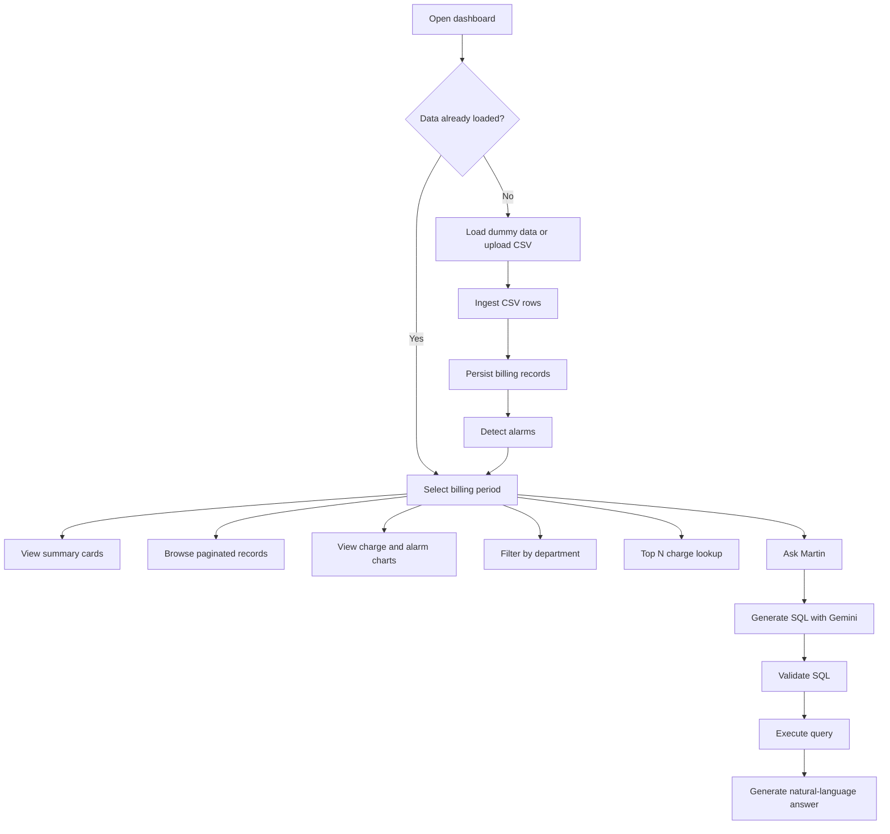
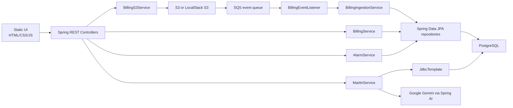
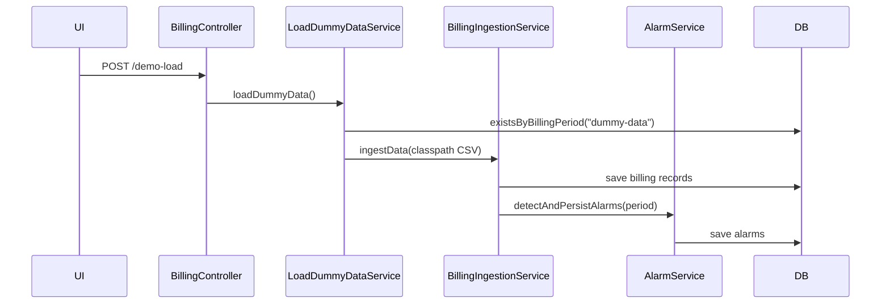
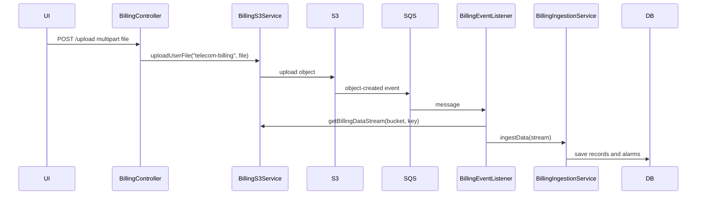
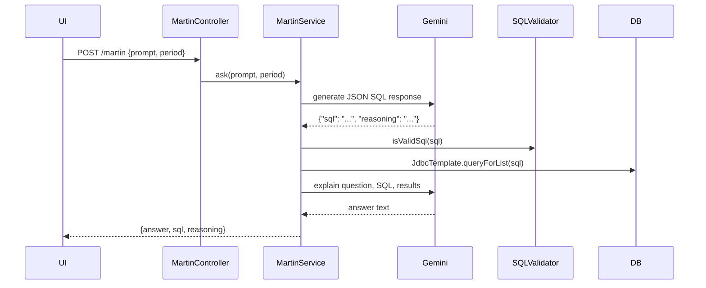

# Blueprint Product and System Documentation

This document explains what Blueprint currently is, how it works, and how the major workflows are implemented. It documents implemented code and clearly labels incomplete or scaffolded systems. 
<br>
Last updated: May 14, 2026
## Project Overview

Blueprint is a telecom billing intelligence dashboard. It helps users ingest telecom billing CSV data, store it in PostgreSQL, inspect records by period and department, summarize charges, surface budget alarms, and ask natural-language billing questions through an AI assistant named Martin.

The current product is a full-stack Spring Boot application with:

- A static HTML/CSS/JavaScript frontend served directly by Spring Boot.
- REST APIs for records, summaries, departments, periods, alarms, upload, demo loading, and Martin chat.
- PostgreSQL persistence through Spring Data JPA.
- CSV ingestion through OpenCSV.
- Event-driven upload processing through S3 object-created events delivered to SQS.
- Local S3/SQS emulation through LocalStack in Docker Compose.
- Google Gemini integration through Spring AI.

Current maturity: functional demo / prototype with real ETL, persistence, alarms, and AI query execution, but incomplete auth, incomplete tests, no migrations, and production deployment assumptions that need hardening.

## Target Users

The implementation is aimed at users who need to inspect telecom billing data:

- Internal finance or operations teams reviewing telecom spend.
- Technical reviewers evaluating ETL, event-driven ingestion, and AI analytics patterns.
- Demo users who do not have their own CSV and can load bundled dummy data.

There is no implemented multi-user account system, tenant model, roles, permissions, or billing/payment system.

## Primary Workflows



## Architecture Overview

### High-Level Architecture



### Frontend Responsibilities

The frontend in `src/main/resources/static` is responsible for:

- Rendering the dashboard, login, info, and 404 pages.
- Calling backend REST APIs with `fetch`.
- Rendering Chart.js charts.
- Handling client-side page interactions such as period selection, pagination controls, upload button, modal open/close, and Martin chat input.

It has no build step, package manager, client-side router, frontend state library, auth provider, or component system.

### Backend Responsibilities

The Spring Boot app is responsible for:

- Serving static files.
- Accepting CSV uploads.
- Uploading files to S3/LocalStack S3.
- Listening for SQS messages triggered by S3 object creation.
- Parsing and ingesting CSV records.
- Persisting billing records and alarms.
- Serving analytics queries.
- Generating AI SQL and explanations through Martin.
- Handling validation and domain exceptions.

## Repository Map

```text
src/main/java/com/azeem/blueprint/
├── BlueprintApplication.java
├── config/
│   ├── AlarmConfig.java
│   └── BillingReaderConfig.java
├── controller/
│   ├── AlarmController.java
│   ├── BillingController.java
│   └── MartinController.java
├── demo/
│   └── LoadDummyDataService.java
├── entity/
│   ├── AlarmEntity.java
│   └── BillingRecordEntity.java
├── etl/
│   ├── BillingRecordAssembler.java
│   ├── CsvBillingReader.java
│   ├── SummaryBuilder.java
│   └── TsvBillingReader.java
├── exception/
├── listener/
│   └── BillingEventListener.java
├── mapper/
│   ├── AlarmMapper.java
│   └── BillingRecordMapper.java
├── model/
│   ├── alarm/
│   ├── billing/
│   └── martin/
├── repository/
│   ├── AlarmRepository.java
│   └── BillingRecordRepository.java
├── service/
│   ├── alarm/
│   ├── billing/
│   └── martin/
├── util/
└── validation/
```

## Core Features

### 1. Demo Data Loading

Purpose: allow the dashboard to work without a user-provided CSV.

User flow:

1. User opens dashboard.
2. User opens Help.
3. User clicks `Load Dummy Data`.
4. Frontend sends `POST /demo-load`.
5. Backend ingests `src/main/resources/dummy-data.csv`.
6. Dashboard refreshes periods, departments, summary, records, and charts.

Backend flow:



Important files:

| File | Role |
|---|---|
| `src/main/resources/dummy-data.csv` | Bundled seed dataset. |
| `src/main/java/com/azeem/blueprint/demo/LoadDummyDataService.java` | Loads seed CSV. |
| `src/main/java/com/azeem/blueprint/controller/BillingController.java` | Exposes `POST /demo-load`. |
| `src/main/resources/static/js/dashboard.js` | Calls `/demo-load` and refreshes UI. |

Status: implemented.

Constraints:

- The loader skips repeat ingestion if any billing record exists for `dummy-data`.
- `dummy-data` is explicitly allowed by `BillingPeriodFormatValidator` even though normal periods must be `YYYY-MM`.

### 2. CSV Upload and Event-Driven Ingestion

Purpose: allow users to upload billing CSVs and process them asynchronously through object storage events.

User flow:

1. User chooses a `.csv` file from the dashboard.
2. User clicks `Upload`.
3. Frontend posts multipart form data to `/upload`.
4. Backend uploads the file to bucket `telecom-billing`.
5. S3/LocalStack emits object-created event to SQS.
6. `BillingEventListener` receives the message and ingests the object.

Backend flow:



Important files:

| File | Role |
|---|---|
| `BillingController.java` | `POST /upload`. |
| `BillingS3Service.java` | S3 download/upload/error-log operations. |
| `BillingEventListener.java` | `@SqsListener("billing-event-queue")`. |
| `BillingIngestionService.java` | Parses, persists, and triggers alarms. |
| `docker-compose.dev.yml` | Creates LocalStack S3/SQS and notification bridge. |

Status: implemented for Docker/LocalStack.

Edge cases and constraints:

- `CsvFileValidator` accepts only non-empty files whose original filename ends with `.csv`.
- `BillingS3Service.uploadUserFile` refuses duplicate object keys by returning early if the object exists.
- Ingestion catches per-row parse errors, records them in an error log buffer, and continues.
- If any row failures occur, `BillingEventListener` uploads an error log to `error-logs/{billingPeriod}-errors.log`.
- The frontend waits two seconds after upload before polling periods and refreshing the dashboard.

### 3. Billing Records and Summary Analytics

Purpose: expose stored billing records and aggregate analytics.

Backend implementation:

| Layer | Files |
|---|---|
| Controller | `BillingController.java` |
| Service | `BillingService.java` |
| Repository | `BillingRecordRepository.java` |
| Entity | `BillingRecordEntity.java` |
| Domain model | `BillingRecord.java`, `BillingSummary.java` |
| Aggregation | `SummaryBuilder.java` |
| Mapper | `BillingRecordMapper.java` |

User-facing dashboard areas:

- Latest period summary cards.
- All records table with pagination.
- Charges by department Chart.js bar chart.
- Department filter table.
- Top N highest charges table.

APIs involved:

| Endpoint | Used by frontend | Behavior |
|---|---|---|
| `GET /periods` | yes | Populates period dropdown. |
| `GET /departments` | yes | Populates department dropdown. |
| `GET /records/period/{billingPeriod}` | yes | Paged all-records table and department chart source. |
| `GET /summary/period/{billingPeriod}` | yes | Summary cards. |
| `GET /records/department/{department}` | yes | Department filter table. |
| `GET /top/{n}` | yes | Top N table. |
| `GET /records` | no current frontend use | All records across periods. |
| `GET /summary` | no current frontend use | Summary across all records. |

Status: implemented.

Constraints:

- `GET /top/{n}` rejects values above `billing.charges.max-top-n`, default 100.
- `GET /top/{n}` also rejects values above the total number of ingested records.
- Period routes validate `YYYY-MM` or `dummy-data`.
- Summary across all records paginates through records in batches of 1,000 in service code.

### 4. Alarm Detection

Purpose: detect telecom spend anomalies/budget alarms after ingestion and expose them for the dashboard.

Alarm scopes:

| Scope | Implementation |
|---|---|
| `DEPARTMENT` | Department total exceeds configured monthly limit. |
| `INDIVIDUAL` | Individual record charge exceeds low/medium/high thresholds. |
| `ACCOUNT` | Grand total exceeds configured account thresholds. |

Configuration in `application.yaml`:

```yaml
alarm:
  department:
    monthlyLimit: 7500
  individual:
    low: 250
    medium: 370
    high: 500
  account:
    low: 45000
    high: 60000
```

Important files:

| File | Role |
|---|---|
| `AlarmDetectionService.java` | Pure detection logic over billing records. |
| `AlarmService.java` | Loads records, deduplicates against existing alarm business keys, persists alarms. |
| `AlarmRepository.java` | Alarm queries. |
| `AlarmController.java` | Alarm API endpoints. |
| `AlarmEntity.java` | Persistence model. |
| `AlarmMapper.java` | Entity/domain mapper. |

Frontend flow:

- Dashboard calls `/alarms/{billingPeriod}` to update the red alarm button count.
- Alarm modal lists all alarms for selected period.
- Alarm severity chart groups returned alarms by LOW, MEDIUM, HIGH, UNKNOWN.

Status: implemented.

Known implementation caveats:

- `AlarmDetectionService` creates new random `businessKey` values every detection run. `AlarmService` checks existing keys, but random keys do not provide deterministic deduplication across repeated detection for the same underlying alarm.
- Department detection only maps a fixed set of departments in the `Department` enum/map. Dummy data contains additional departments such as `Security` and `Quality`; those can still exist as billing record departments but will not map to department-scoped alarm enum values.
- In `getGrandTotalOverLimit`, the high branch condition is `grandTotal >= accountLow`, not `grandTotal >= accountHigh`, because it is in the `else if` after the low-range check. Practically this means totals at or above `accountHigh` become high, but the condition label is imprecise.

### 5. Martin AI Analytics

Purpose: let users ask natural-language questions about billing data.

Backend flow:



Important files:

| File | Role |
|---|---|
| `MartinController.java` | Exposes `POST /martin`. |
| `MartinService.java` | Prompting, Gemini calls, validation orchestration, explanation generation. |
| `SchemaService.java` | Hardcoded schema string provided to Gemini. |
| `SqlValidationService.java` | Lightweight SQL safety check. |
| `QueryExecutionService.java` | Executes generated SQL with `JdbcTemplate`. |
| `MartinRequest.java`, `MartinResponse.java`, `SqlResponse.java` | Request/response models. |

Prompt behavior:

- Gemini is instructed to act as a PostgreSQL query generator.
- Gemini must return only JSON with `sql` and `reasoning`.
- Prompt includes the hardcoded database schema.
- Prompt instructs that all queries must include the selected `billing_period`.
- A second Gemini call turns SQL results into a billing analyst answer.

Status: implemented, but security-hardening incomplete.

Safety boundaries:

- `SqlValidationService` only allows SQL strings starting with `select`.
- It blocks strings containing `insert`, `update`, `delete`, `drop`, and `alter`.
- There is a TODO to use a SQL AST parser such as JSQLParser.

Risk:

- The generated SQL is executed directly through `JdbcTemplate.queryForList`.
- Validation does not currently parse SQL grammar, enforce a table allowlist, enforce a hard row limit, or verify the period predicate beyond prompting the model.

### 6. Login Page

Purpose: provide a demo entry screen.

Implementation:

| File | Role |
|---|---|
| `src/main/resources/static/login.html` | Login UI. |
| `src/main/resources/static/js/login.js` | Non-empty username/password validation, success message, redirect. |
| `src/main/resources/static/css/login.css` | Login styling. |

Status: demo-only.

Behavior:

- `Sign In` requires non-empty username and password, logs credentials to the browser console, shows success, and redirects to `/`.
- `Continue as Guest` shows success and redirects to `/`.
- There is no backend login endpoint.
- There is no Spring Security dependency/configuration.
- There are no users, password hashing, sessions, JWTs, protected routes, roles, or permissions.

## Authentication and Authorization

No real authentication or authorization is implemented.

What exists:

- Static `login.html`.
- Client-side validation only.
- Client-side redirect into dashboard.

What does not exist:

- No `spring-boot-starter-security`.
- No auth controller.
- No user entity/table.
- No session or token middleware.
- No roles or permissions.
- No protected API routes.

This is a significant gap if the app is exposed beyond a trusted demo environment.

## Data Model Overview

### BillingRecord

Domain model: `src/main/java/com/azeem/blueprint/model/billing/BillingRecord.java`

Persistence model: `src/main/java/com/azeem/blueprint/entity/BillingRecordEntity.java`

Fields:

| Field | Type | Meaning |
|---|---|---|
| `id` | `long` | DB-generated primary key, entity only. |
| `accountName` | `String` | Billing account/person name. |
| `employeeId` | `String` | Employee identifier. |
| `department` | `String` | Department name. |
| `phoneNumber` | `String` | Phone number. |
| `billingPeriod` | `String` | Period, usually `YYYY-MM`, or `dummy-data`. |
| `minutesUsed` | `int` | Usage minutes. |
| `dataGbUsed` | `double` | Data usage. |
| `smsCount` | `int` | SMS usage. |
| `totalCharge` | `double` | Total charge. |

Relationships:

- No JPA relationship is declared between billing records and alarms.
- Alarms reference period/employee/phone/department values as denormalized fields.

### Alarm

Domain model: `src/main/java/com/azeem/blueprint/model/alarm/Alarm.java`

Persistence model: `src/main/java/com/azeem/blueprint/entity/AlarmEntity.java`

Fields:

| Field | Type | Meaning |
|---|---|---|
| `id` | UUID | DB-generated primary key. |
| `businessKey` | UUID | Unique key intended for deduplication. |
| `alarmScope` | enum | `INDIVIDUAL`, `DEPARTMENT`, or `ACCOUNT`. |
| `billingPeriod` | String | Associated period. |
| `alarmType` | String | Human-readable type. |
| `alarmSeverity` | enum | `LOW`, `MEDIUM`, `HIGH`. |
| `explanation` | String | Display explanation. |
| `timestamp` | Instant | Detection time. |
| `employeeId` | String nullable | Used for individual alarms. |
| `phoneNumber` | String nullable | Used for individual alarms. |
| `department` | enum nullable | Used for department alarms. |

### Martin Models

| Model | Fields | Role |
|---|---|---|
| `MartinRequest` | `prompt`, `period` | Request body from frontend. |
| `SqlResponse` | `sql`, `reasoning` | Expected Gemini JSON response for SQL generation. |
| `MartinResponse` | `answer`, `sql`, `reasoning` | Response returned to frontend. |

## API Documentation

There is no generated OpenAPI spec. The route list below is the source-code-derived API.

### Request and Response Patterns

- Spring MVC controllers return JSON for API responses.
- Paged endpoints return Spring `Page<T>` JSON shape with `content`, page metadata, and sort metadata.
- Error responses use `ErrorResponse` with `status`, `message`, and `timestamp` for handled exceptions.
- Validation uses Jakarta Bean Validation annotations on controller parameters and custom validators.

### Billing Routes

| Method | Path | Request | Response | Validation |
|---|---|---|---|---|
| `POST` | `/upload` | multipart `file` | plain text success | `@ValidCsvFile` |
| `POST` | `/demo-load` | none | plain text success | none |
| `GET` | `/records` | query `page`, `size` | `Page<BillingRecord>` | no min/max annotations here |
| `GET` | `/summary` | none | `BillingSummary` | throws if no data |
| `GET` | `/records/department/{department}` | path + `page`, `size` | `Page<BillingRecord>` | department not blank, page >= 0, size 1-100 |
| `GET` | `/top/{n}` | path `n` | `Page<BillingRecord>` | n 1-100 plus service max and count checks |
| `GET` | `/departments` | none | `List<String>` | none |
| `GET` | `/periods` | none | `List<String>` | none |
| `GET` | `/records/period/{billingPeriod}` | path + `page`, `size` | `Page<BillingRecord>` | custom billing period validator |
| `GET` | `/summary/period/{billingPeriod}` | path | `BillingSummary` | custom billing period validator |

### Alarm Routes

| Method | Path | Response |
|---|---|---|
| `GET` | `/alarms/{billingPeriod}` | `List<Alarm>` |
| `GET` | `/alarms/department/{billingPeriod}` | `List<Alarm>` |
| `GET` | `/alarms/individual/{billingPeriod}` | `List<Alarm>` |
| `GET` | `/alarms/account/{billingPeriod}` | `List<Alarm>` |

### Martin Route

```http
POST /martin
Content-Type: application/json

{
  "prompt": "What departments have the highest total charges?",
  "period": "dummy-data"
}
```

Response:

```json
{
  "answer": "...",
  "sql": "select ...",
  "reasoning": "..."
}
```

## AI / Automation Systems

AI provider:

- Spring AI Google GenAI starter.
- Configured model: `gemini-2.5-flash`.
- Configured temperature: `0.1`.
- Location: `us-central1`.

AI-controlled logic:

- Martin generates SQL.
- Martin generates an explanation based on prompt, generated SQL, and query results.

Deterministic logic:

- CSV parsing.
- Billing record assembly.
- Summary aggregation.
- Alarm detection.
- SQL validation checks.
- Query execution.

Safety boundaries:

- Prompt instructs read-only SQL.
- String-based validation blocks obvious non-read SQL.
- No AST parser, SQL allowlist, row limit, or execution sandbox is implemented.

## Frontend System

### Routes and Pages

| Route | File | Purpose |
|---|---|---|
| `/` | `index.html` | Dashboard. |
| `/index.html` | `index.html` | Dashboard. |
| `/login.html` | `login.html` | Demo login/guest entry. |
| `/info.html` | `info.html` | About/info page. |
| `/error/404.html` | `error/404.html` | Static 404 page. |

### JavaScript Files

| File | Purpose |
|---|---|
| `js/main.js` | Shared navigation helpers on `window.Blueprint`. |
| `js/dashboard.js` | Dashboard state, backend calls, chart rendering, modals, upload, demo load, Martin chat. |
| `js/login.js` | Login and guest redirect behavior. |
| `js/info.js` | Open dashboard button. |
| `js/error.js` | Go home button. |

### Frontend State Management

State is simple module/global state in `dashboard.js`:

```js
let deptChartInstance = null;
let alarmsChartInstance = null;
let currentPeriod = null;
let currentPageAllRecords = 0;
let currentPageFilterByDepartment = 0;
const pageSize = 20;
```

No frontend framework, no router, no stores, and no build-time types exist.

### UI Dependencies

- Bootstrap 5.3.2 via CDN.
- Chart.js via CDN.
- Google Fonts Montserrat via CDN.

## Backend System

### Controller Layer

| Controller | Responsibility |
|---|---|
| `BillingController` | Upload, demo load, records, summary, departments, periods, top N. |
| `AlarmController` | Alarm retrieval by scope and period. |
| `MartinController` | AI chat endpoint. |

### Service Layer

| Service | Responsibility |
|---|---|
| `BillingService` | Read-only billing queries and summaries. |
| `BillingIngestionService` | CSV stream ingestion, batching, persistence, alarm triggering. |
| `BillingS3Service` | S3 object upload/download/error-log upload. |
| `LoadDummyDataService` | Classpath seed data ingestion. |
| `AlarmDetectionService` | Pure alarm detection rules. |
| `AlarmService` | Alarm persistence and read APIs. |
| `MartinService` | Gemini prompt orchestration, validation, SQL execution, explanation. |
| `QueryExecutionService` | SQL execution through `JdbcTemplate`. |
| `SchemaService` | Hardcoded schema string for AI prompts. |
| `SqlValidationService` | Lightweight SQL validation. |

### Persistence Layer

- Spring Data JPA repositories for `billing_records` and `alarms`.
- `JdbcTemplate` for AI-generated SQL execution.
- Hibernate schema generation, no migrations.

### Background Processing

Implemented background/event processing:

- `BillingEventListener` uses `@SqsListener("billing-event-queue")`.
- It expects S3 event JSON with `Records[0].s3.bucket.name` and `Records[0].s3.object.key`.
- It downloads the object and ingests the CSV.

No other scheduled jobs, worker processes, cron jobs, or async executors are present.

## Infrastructure

### Docker

Development:

- `docker-compose.dev.yml`
- Postgres 16.
- LocalStack 3.0.0 with S3 and SQS.
- App container built from Dockerfile.
- Inline AWS CLI setup container.

Production-like:

- `docker-compose.prod.yml`
- Same app/Postgres/LocalStack pattern.
- Adds Cloudflare tunnel.
- Uses host bind mounts under `/home/jawadazeem`.
- Explicitly documented as not real production infrastructure.

### CI/CD

Workflow:

```text
.github/workflows/docker-pipeline.yml
```

Trigger:

```text
push to main
```

Runner:

```text
self-hosted
```

Deployment command:

```bash
ln -sf /home/jawadazeem/billing/.env .env
docker compose -f docker-compose.prod.yml down
docker compose --env-file .env -f docker-compose.prod.yml up --build -d
docker system prune -f
```

### Observability and Logging

- Spring Boot Actuator is included.
- `application.yaml` configures `logging.file.name: app.log`.
- No metrics backend, tracing, dashboards, alerts, or log aggregation are configured in repo.

### Storage Providers

- S3 abstraction through Spring Cloud AWS S3.
- Local default endpoint points to LocalStack.
- Upload bucket name is hardcoded as `telecom-billing` in controller/Compose setup.
- Error logs are uploaded to `error-logs/{billingPeriod}-errors.log`.

### Queues and Events

- SQS abstraction through Spring Cloud AWS SQS.
- Queue name hardcoded in listener: `billing-event-queue`.
- Compose setup configures S3 bucket notifications to SQS.

## Local Development Workflow

Recommended:

```bash
docker compose --env-file .env -f docker-compose.dev.yml up --build
```

Known blocker:

- Docker build runs `mvn package`.
- Maven currently fails at Spotless due test placeholder formatting.
- Run `mvn spotless:apply` before building if needed.

Development verification:

```bash
curl http://localhost:8080/actuator/health
curl -X POST http://localhost:8080/demo-load
curl http://localhost:8080/periods
curl http://localhost:8080/summary/period/dummy-data
```

Debug logs:

```bash
docker compose -f docker-compose.dev.yml logs app
docker compose -f docker-compose.dev.yml logs localstack
docker compose -f docker-compose.dev.yml logs aws-cli-setup
```

## Known Gaps / Technical Debt

| Area | Finding |
|---|---|
| Auth | Login is client-only demo behavior. Backend has no auth or route protection. |
| Secrets | `.env` is checked in and includes real-looking values. Rotate secrets and remove from history. |
| Migrations | No Flyway/Liquibase. Schema generation depends on Hibernate settings. |
| Prod Compose profile | `docker-compose.prod.yml` uses `SPRING_PROFILES_ACTIVE=dev`, which selects `create-drop`. |
| AI SQL validation | String-based validation is not sufficient for robust SQL safety. Code contains TODO for AST parser. |
| Martin prompt | Prompt concatenation around `billing_period =` and schema text is brittle and does not quote/escape period value in the instruction. |
| Martin query limits | No hard result limit is enforced for generated SQL. |
| Alarm deduplication | Random business keys make deduplication ineffective across repeated detections. |
| Department enum mismatch | Billing records store free-form department strings, but department alarms support only enum values in a fixed map. |
| Test suite | Several test classes are empty placeholders; `mvn test` currently blocked by Spotless placeholder formatting. |
| API docs | No OpenAPI/Swagger. |
| Frontend | No frontend tests, linting, package manager, bundling, or module system. |
| Deployment | README references AWS services beyond what the checked-in deployment currently provisions. |
| Empty script | `init-s3.sh` exists but has no content. |
| Duplicate naming | Test mapper placeholder files are named `AlarmMapper.java` and `BillingRecordMapper.java`, not `*Test.java`. |

## Future Architecture Considerations

These are natural next steps based on the current codebase, not implemented features.

### Harden AI Query Execution

- Replace string checks with SQL AST parsing.
- Enforce table and column allowlists.
- Enforce `billing_period` predicate programmatically.
- Add query timeout and row limit.
- Consider read-only DB user for Martin queries.

### Add Real Authentication

- Add Spring Security only when product needs protected access.
- Decide between session auth and token auth.
- Remove credential logging from `login.js`.
- Protect upload and Martin endpoints before public exposure.

### Add Migrations

- Introduce Flyway or Liquibase.
- Stop relying on `ddl-auto` for persistent environments.
- Fix production-like Compose to use `prod` profile or a safer profile.

### Separate Ingestion Boundaries

- Make object bucket/queue names configurable.
- Add deterministic idempotency keys for billing uploads and alarms.
- Consider moving ingestion into a separate worker if upload volume grows.

### Improve Frontend Robustness

- Add error states for failed API calls.
- Add loading states for dashboard sections.
- Add frontend tests if the static UI grows.
- Keep the no-build approach only while UI complexity stays small.

### Improve Deployment Clarity

- Align README architecture claims with checked-in deployment.
- Document whether the intended target is single-server Compose, AWS ECS/RDS, or both.
- Add deployment environment examples without secrets.
